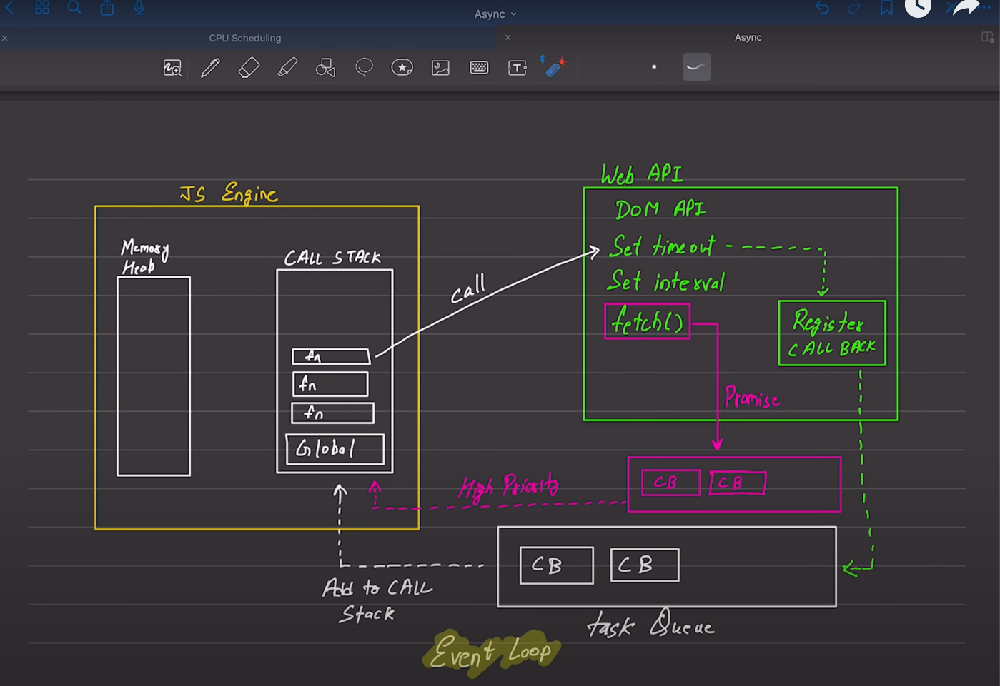

Javascript is a single threaded synchronus language.(Default behaviour)
Executes one line of a code at a time. Each operation waits for the last one to complete.

# Blocking vs Non-Blocking code

1. Blocking code: blocks the flow of the program. (Read file sync)
2. Non-Blocking code: do not blocks the execution. (Read file async)

# Diagram

